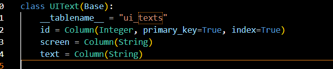

# Activitat 11 - Backend del Joc del Penjat

Aquest projecte implementa el backend per a un joc del Penjat utilitzant **FastAPI** i **PostgreSQL**.  
El sistema inclou la gestió d'usuaris, paraules, partides i informació estàtica per a la interfície d'usuari.

Taula users (Usuaris)
Guarda informació dels jugadors:

Taula words (Paraules)
Conté les paraules que poden aparèixer al joc:

Taula game_logs (Registre de Partides)
Guarda les partides jugades:

Taula ui_texts (Textos de la UI)
Guarda els textos estàtics per renderitzar les pantalles del joc:

# Esquemas Pydantic

